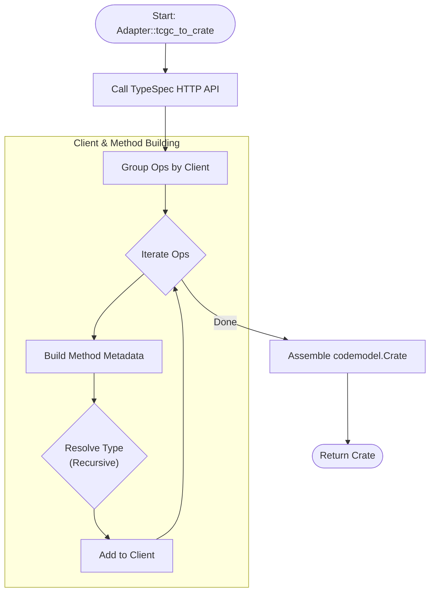
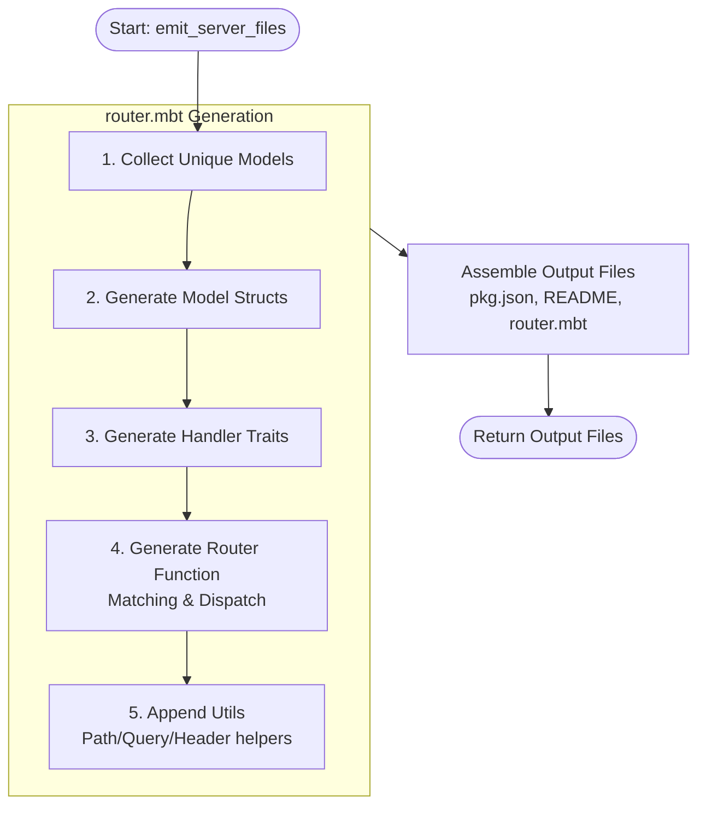

# kkkiio/typespec-moonbit

Typespec MoonBit Emitter. Writen in MoonBit.

## Features

- [x] http server

## Architecture

#### Adapter 流程图 (`tcgcadapter`)

展示如何将 TypeSpec 编译器对象转换为 `CodeModel`。

#### Server Codegen 流程图 (`server.mbt`)

展示如何根据 `CodeModel` 生成服务端的 MoonBit 源代码。

